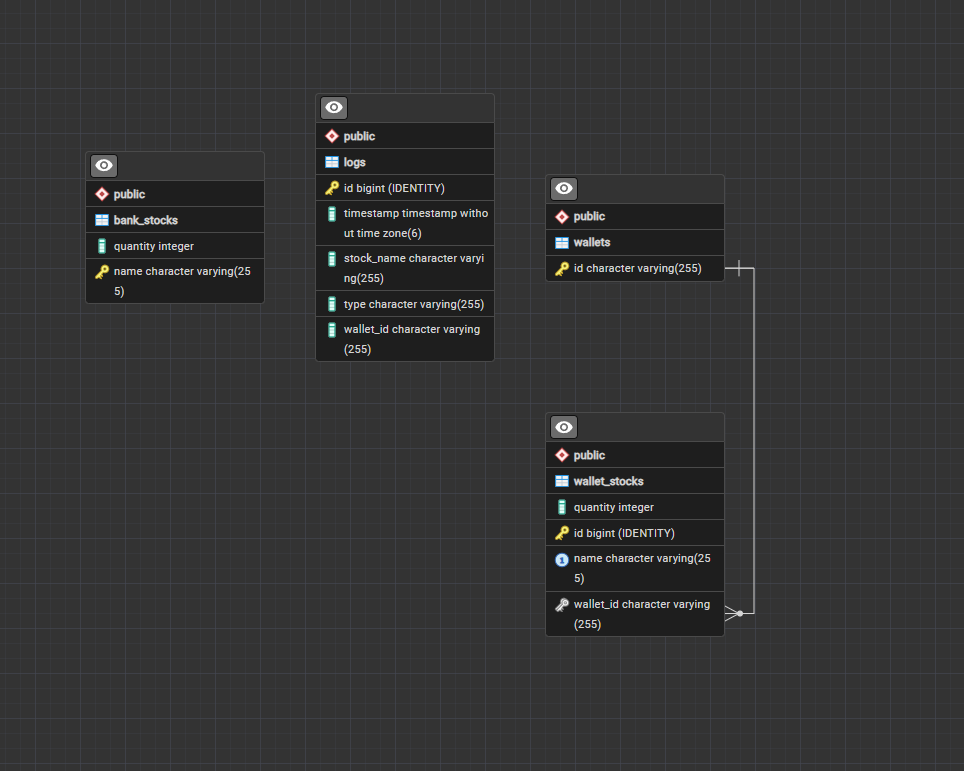
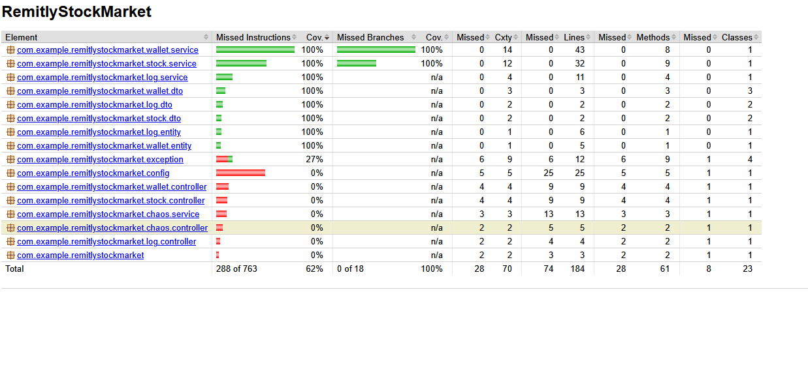

# RemitlyStockMarket
## Created by Hubert Sanocki,

A simplified Spring Boot stock market app with:
- bank stock management
- wallet buy/sell transactions
- global error handling
- transaction logging

## Tech

- Java 21
- Spring Boot 4
- Maven
- Docker
- Spring Data JPA
- Spring Security
- PostgreSQL
- Flyway
- OpenAPI / Swagger UI
- JUnit

## Features

- Manage bank stock inventory (`/stocks`)
- Create transactions (`buy` / `sell`) (`/wallets`)
- Read wallet stock state (`/wallets/{id}`)
- Read transaction logs (`/log`)

## Requirements

- Docker/Docker Desktop

## Run with Docker

Start the app on a local port 8080:

```powershell
docker compose up --build
```

## Shut down the app

```bash
docker compose down
```

## Access via Swagger UI
Open your browser and navigate to:  
```
http://localhost:8080/swagger-ui.html
```

## Main Endpoints

### Stock (Bank inventory)
- `POST /stocks/state` - Create initial bank stock state
- `POST /stocks` - Add stock to bank inventory
- `GET /stocks` - List all stocks

### Wallet (User transactions)
- `GET /wallets/{wallet_id}` - List all stocks in wallet
- `GET /wallets/{wallet_id}/stocks/{stock_name}` - Return quantity of one stock in wallet
- `POST /wallets/{wallet_id}/stocks/{stock_name}` - Create buy/sell transaction for one stock

### Log (Transaction history)
- `GET /log` - List all transactions

### Chaos
- `POST /chaos` - Terminate current app instance

## Testing
```bash
mvn clean test
mvn jacoco:report
```

